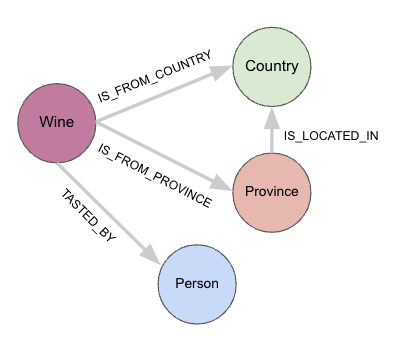

# Neo4j

[Neo4j](https://neo4j.com/) is an ACID-compliant transactional database with native graph storage and processing, popular for use cases where we want to query connected data. The primary use case for a graph database is to answer business questions that involve connected data.

* Which wines from Chile were tasted by at least two different tasters?
* What are the top-rated wines from Italy that share their variety with my favourite ones from Portugal?

Code is provided for ingesting the wine reviews dataset into Neo4j in an async fashion. In addition, a query API written in FastAPI is also provided that allows a user to query available endpoints. As always in FastAPI, documentation is available via OpenAPI (http://localhost:8000/docs).

* All code (wherever possible) is async
* [Pydantic](https://docs.pydantic.dev) is used for schema validation, both prior to data ingestion and during API request handling
  * The same schema is used for data ingestion and for the API, so there is only one source of truth regarding how the data is handled
* For ease of reproducibility, the whole setup is orchestrated and deployed via docker

## Setup

Note that this code base has been tested in Python 3.11, and requires a minimum of Python 3.10 to work. Install dependencies via `requirements.txt`.

```sh
# Setup the environment for the first time
python -m venv neo4j_venv  # python -> python 3.10+
python -m pip install -r requirements.txt
# Activate the environment (for subsequent runs)
source neoj_venv/bin/activate
```

--- 

## Step 1: Set up containers

Use the provided `docker-compose.yml` to initiate separate containers, one that run Neo4j, and another one that serves as an API on top of the database.

```
docker compose up -d
```

This compose file starts a persistent-volume Neo4j database with credentials specified in `.env`. The `db` variable in the environment file indicates that we are opening up the database service to a FastAPI server (running as a separate service, in a separate container) downstream. Both containers can communicate with one another with the common network that they share, on the exact port numbers specified.

The services can be stopped at any time for maintenance and updates.

```
docker compose down
```

**Note:** The setup shown here would not be ideal in production, as there are other details related to security and scalability that are not addressed via simple docker, but, this is a good starting point to begin experimenting!


## Step 1: Ingest the data

The first step is to ingest the wine reviews dataset into Neo4j. To do this, we first conceptualize the following data model:



The idea behind this data model is as follows:

* We want to be able to query for wines from a specific region, or country, or both
  * The taste of wine is influenced by both the province (i.e., specific region) of a country, as well as the general part of the world it is from
* We also want to be able to relate wines to the person that tasted them to give them a particular number of points for a review

The data model can be far more detailed than this example, and depends heavily on the use cases for which we want to query for. At present, this model will suffice.

### Run async data loader

Data is asynchronously ingested into the Neo4j database through the scripts in the `scripts` directly.

```sh
cd scripts
python build_graph.py
```

This script validates the input JSON data via [Pydantic](https://docs.pydantic.dev), and then asynchronously ingests them into Neo4j using the [Neo4j `AsyncGraphDatabase` driver](https://neo4j.com/docs/api/python-driver/current/async_api.html), with appropriate constraints and indexes for best performance.

## Step 3: Test API

Once the data has been successfully loaded into Neo4j and the containers are up and running, we can test out a search query via an HTTP request as follows.

```sh
curl -X 'GET' \
  'http://localhost:8000/wine/search?terms=tuscany%20red'
```

This cURL request passes the search terms "**tuscany red**" to the `/wine/search/` endpoint, which is then parsed into a working Cypher query by the FastAPI backend. The query runs and retrieves results from a full text search index (that looks for these keywords in the wine's title and description), and, if the setup was done correctly, we should see the following response:

```json
[
    {
        "wineID": 66393,
        "country": "Italy",
        "title": "Capezzana 1999 Ghiaie Della Furba Red (Tuscany)",
        "description": "Very much a baby, this is one big, bold, burly Cab-Merlot-Syrah blend that's filled to the brim with extracted plum fruit, bitter chocolate and earth. It takes a long time in the glass for it to lose its youthful, funky aromatics, and on the palate things are still a bit scattered. But in due time things will settle and integrate",
        "points": 90,
        "price": 49,
        "variety": "Red Blend",
        "winery": "Capezzana"
    },
    {
        "wineID": 40960,
        "country": "Italy",
        "title": "Fattoria di Grignano 2011 Pietramaggio Red (Toscana)",
        "description": "Here's a simple but well made red from Tuscany that has floral aromas of violet and rose with berry notes. The palate offers bright cherry, red currant and a touch of spice. Pair this with pasta dishes or grilled vegetables.",
        "points": 86,
        "price": 11,
        "variety": "Red Blend",
        "winery": "Fattoria di Grignano"
    },
    {
        "wineID": 73595,
        "country": "Italy",
        "title": "I Giusti e Zanza 2011 Belcore Red (Toscana)",
        "description": "With aromas of violet, tilled soil and red berries, this blend of Sangiovese and Merlot recalls sunny Tuscany. It's loaded with wild cherry flavors accented by white pepper, cinnamon and vanilla. The palate is uplifted by vibrant acidity and fine tannins.",
        "points": 89,
        "price": 27,
        "variety": "Red Blend",
        "winery": "I Giusti e Zanza"
    }
]
```

Not bad! This example correctly returns some highly rated Tuscan red wines along with their price and country of origin (obviously, Italy in this case).

### Step 4: Extend the API

The API can be easily extended with the provided structure.

- The `schemas` directory houses the Pydantic schemas, both for the data input as well as for the endpoint outputs
  - As the data model gets more complex, we can add more files and separate the ingestion logic from the API logic here
- The `api/routers` directory contains the endpoint routes so that we can provide additional endpoint that answer more business questions
  - For e.g.: "What are the top rated wines from Argentina?"
  - In general, it makes sense to organize specific business use cases into their own router files
- The `api/main.py` file collects all the routes and schemas to run the API


#### Existing endpoints

So far, the following endpoints that help answer interesting questions have been implemented.

```
GET
/wine/search
Search By Keywords
```

```
GET
/wine/top_by_country
Top By Country
```

```
GET
/wine/top_by_province
Top By Province
```

```
GET
/wine/most_by_variety
Most By Variety
```

Run the FastAPI app in a docker container to explore them!

